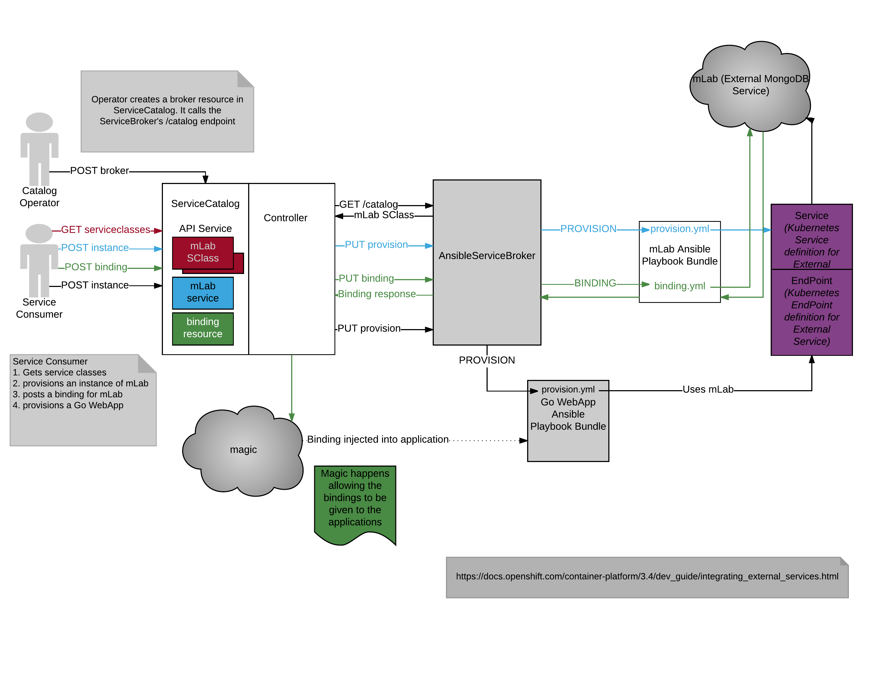
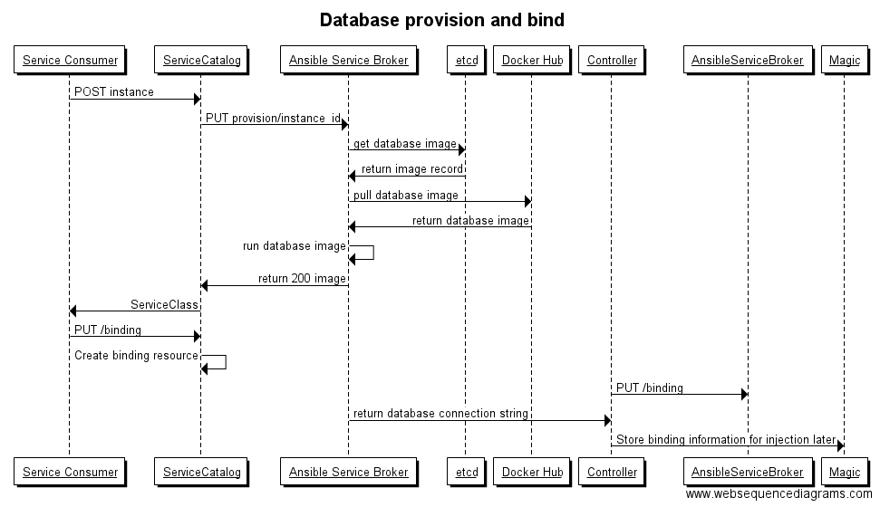

# Bind Use Cases

## External Service with Bind (mLab and webapp)
The external service use case is where an AnsibleApp is able to connect to a service outside of the cluster. One example, is a webapp that uses mLab as their backend store. There will be a specific AnsibleApp for the external service.

Catalog Operator does the following:
* Creates a broker resource which calls the AnsibleServiceBroker /catalog endpoint
* The /catalog endpoint response populates the ServiceCatalog's list of ServiceClasses. In our example, this is mLab and Go WebApp

The Service Consumer then utilizes the ServiceClasses for their needs. After getting a list of the available service classes, the Consumer will then:

* Creates an instance of the mLab service.
  * ServiceCatalog calls provision endpoint on AnsibleServiceBroker
  * AnsibleServiceBroker provisions the mLab AnsibleApp
  * mLab AnsibleApp configures the mLab instance being made avaiable
  * mLab service ready for consumption
* Create a binding resource for the mLab service
  * ServiceCatalog calls the binding endpoint on the AnsibleServiceBroker
  * AnsibleServiceBroker calls bind on the mLab AnsibleApp
  * mLab AnsibleApp will return the credentials, coordinates, & configs for the service.
  * Magic happens
    * ServiceCatalog does something with the bind information such that it can be injected into the applications later
* Creates an instance of the Go WebApp service.
  * ServiceCatalog calls provision endpoint on AnsibleServiceBroker
  * AnsibleServiceBroker provisions the Go WebApp AnsibleApp
  * The mLab binding information is *injected* into the Go WebApp AnsibleApp
  * Go WebApp AnsibleApp configures itself to use the information
  * Go WebApp service is ready for consumption and utilizing the mLab service



## Issues

* does the service consumer have to initiate the binds?

## database that handles binds

* provision database ansibleapp (stays up to let other bind)
* bind request to app returns connection information,

    ```
    User -> ServiceCatalog: POST instance
    ServiceCatalog -> Ansible Service Broker: PUT provision/instance_id
    Ansible Service Broker -> etcd : get database image
    etcd -> Ansible Service Broker: return image record
    Ansible Service Broker -> Docker Hub: pull database image
    Docker Hub -> Ansible Service Broker: return database image
    Ansible Service Broker -> Ansible Service Broker: run database image
    Ansible Service Broker -> ServiceCatalog: return 200 image
    ServiceCatalog -> User: ServiceClass
    User -> ServiceCatalog: POST binding
    ServiceCatalog -> Ansible Service Broker: PUT bind
    Ansible Service Broker -> ServiceCatalog: return database connection string
    ServiceCatalog -> ServiceCatalog: Create Binding
    ServiceCatalog -> User: binding instance
    ```
## Etherpad wants to connect to database

* provision database instance
* provision etherpad
* bind to database

    sounds like the database if it exists in the same namespace will be INJECTED
    into the etherpad provision as env variables
    ```
    # assume database instance was previously provisioned
    User -> ServiceCatalog: POST etherpad instance
    ServiceCatalog -> Ansible Service Broker: PUT provision/instance_id
    Ansible Service Broker -> etcd : get etherpad image
    etcd -> Ansible Service Broker: return image record
    Ansible Service Broker -> Docker Hub: pull etherpad image
    Docker Hub -> Ansible Service Broker: return etherpad image
    Ansible Service Broker -> Ansible Service Broker: run etherpad image
    Ansible Service Broker -> ServiceCatalog: return 200 OK
    ServiceCatalog -> User: ServiceClass
    User -> ServiceCatalog: POST binding
    ServiceCatalog -> Ansible Service Broker: PUT bind
    Ansible Service Broker -> ServiceCatalog: return database connection string
    ServiceCatalog -> ServiceCatalog: Create Binding
    ServiceCatalog -> User: binding instance
    ```
## Connect to external database

* external database installed in datacenter
* provision database ansibleapp 'proxy'
* provision etherpad
    ```
    # assume database installed
    A User -> ServiceCatalog: POST database proxy ansibleapp
    ServiceCatalog -> Ansible Service Broker: PUT provision/instance_id
    Ansible Service Broker -> etcd : get database 'proxy' image
    etcd -> Ansible Service Broker: return image record
    Ansible Service Broker -> Docker Hub: pull database 'proxy' image
    Docker Hub -> Ansible Service Broker: return database 'proxy' image
    Ansible Service Broker -> Ansible Service Broker: run database 'proxy' image
    Database 'Proxy' -> External Database: connect
    Ansible Service Broker -> ServiceCatalog: return 200 OK
    ServiceCatalog -> User: ServiceClass

    A User -> ServiceCatalog: POST etherpad instance
    ServiceCatalog -> Ansible Service Broker: PUT provision/instance_id
    ServiceCatalog -> Ansible Service Broker: INJECT DATABASE
    Ansible Service Broker -> etcd : get etherpad image
    etcd -> Ansible Service Broker: return image record
    Ansible Service Broker -> Docker Hub: pull etherpad image
    Docker Hub -> Ansible Service Broker: return etherpad image
    Ansible Service Broker -> Ansible Service Broker: GET DATABASE INFO
    Ansible Service Broker -> Ansible Service Broker: run etherpad image pass DATABASE INFO
    Ansible Service Broker -> ServiceCatalog: return 200 OK

    ```
